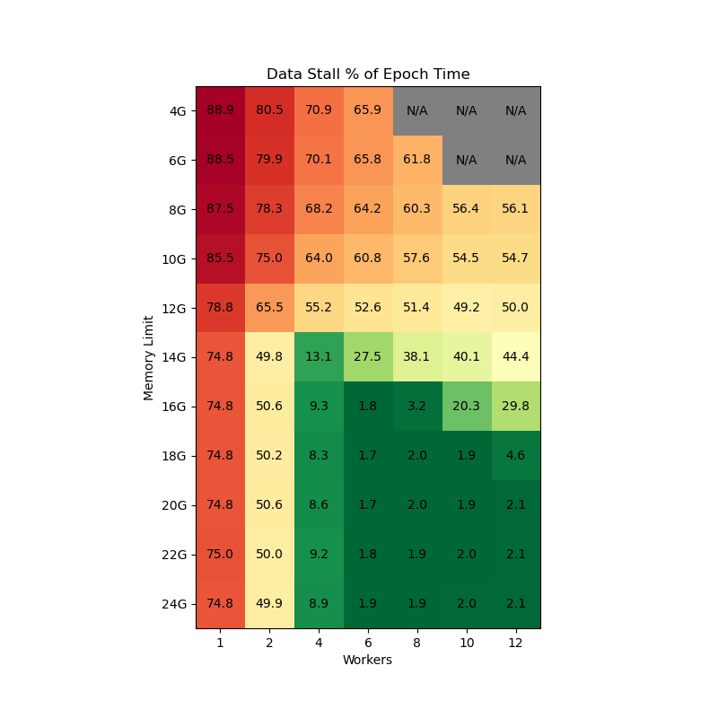

# Creating figures

## How to create worker vs. memory limit heatmap figure

1. Provision a GPU node (Ubuntu 20/Cuda 11.2).
1. Go through the regular GPUfs setup, downloading the 10GB dataset.
1. Create a swap file (e.g., 64GB) and enable swap ([tutorial](https://docs.oracle.com/cd/E24457_01/html/E21988/giprn.html)).
1. Install cgroup tools (`sudo apt-get install cgroup-tools`)
1. Configure `worker-mem-vary.sh` for your setup (GPU, workers, memory limits). Note that because bash doesn't allow you have nested lists, you'll need to enumerate each worker/limit pair that you want to test.
1. Run `worker-mem-vary.sh`. This will take a long time (likely tens of minutes per worker/limit pair). The output will be saved to `p100` (e.g., `alexnet-256-batch_size-2-workers-10G-limit-69.4%-usage.csv`). You may want to run this using a [tmux](https://tmuxcheatsheet.com/) session, so that if your connection breaks at some point, the script will continue running.
1. Copy the output to wherever you're running the Jupyter notebook (`DNNStall-figures.ipynb`).
1. Configure the paths and worker/limit settings in the notebook and run the "Worker/Mem Heatmap" section.

### Examples:

