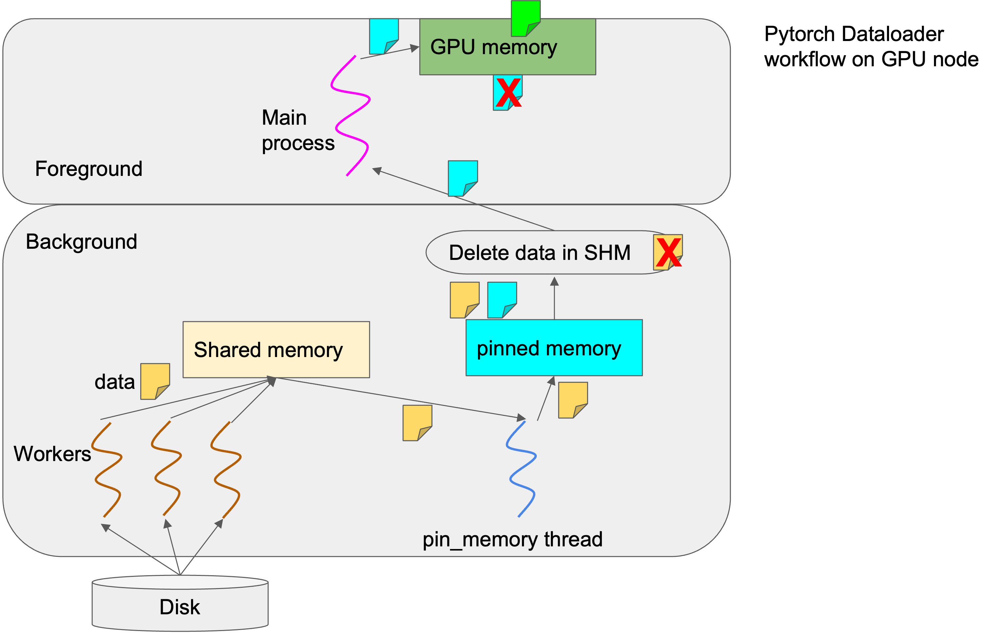

# About -- How Pytorch implements its data loader

Here I briefly introduce how Pytorch's data loder works (specifically for imagenet classification). For more details, please study the Pytorch source codes. 

Regarding how to study source codes, please see [learn-pytorch-source.md](learn-pytorch-source.md). I learned all the things below by following this method and adding "print" here and there.

In [imagenet training script](../exp/main-original.py), actually only 3 lines of codes are related to data loading:

```python
# 1st
train_dataset = datasets.ImageFolder(
        traindir,
        transforms.Compose([
            transforms.RandomResizedCrop(224),
            transforms.RandomHorizontalFlip(),
            transforms.ToTensor(),
            normalize,
        ]))

# 2nd
train_loader = torch.utils.data.DataLoader(
        train_dataset, batch_size=args.batch_size, shuffle=(train_sampler is None),
        num_workers=args.workers, pin_memory=True, sampler=train_sampler)

# 3rd
for i, (images, target) in enumerate(train_loader):
```

## datasets.ImageFolder

`datasets.ImageFolder()` is implemented in `torchvision` codes: [torchvision/datasets
/folder.py](https://github.com/pytorch/vision/blob/main/torchvision/datasets/folder.py).

You need to read this file to understand it. But basically, it tries to find out the classes (we are doing image classification here) from the given path.

## torch.utils.data.DataLoader
It's implemented in `pytorch` source codes: [torch/utils/data
/dataloader.py](https://github.com/pytorch/pytorch/blob/main/torch/utils/data/dataloader.py)

It creates a data loder, with the dataset being `datasets.ImageFolder` that you have just created.

## for i, (images, target) in enumerate(train_loader)

The first call of this `for ... in ...` will call the `__iter__()` function in `Dataloder` class, which creates an iterator. The iterator can either be a `_SingleProcessDataLoaderIter` or be a `_MultiProcessingDataLoaderIter`.

`_SingleProcessDataLoaderIter` is simple. You can easily understand it by reading its implementation codes (it's just a few lines of codes.) So I'll talk more about `_MultiProcessingDataLoaderIter` here.

### _MultiProcessingDataLoaderIter

`_MultiProcessingDataLoaderIter` creates `N` workers to read and preprocess data in parallel. Every worker deals with one batch at a time. The value of `N` is specificed with `--workers` or `-j` in `main-original.py`.

The worker implementation is in [torch/utils/data/_utils/worker.py](https://github.com/pytorch/pytorch/blob/main/torch/utils/data/_utils/worker.py)

Every worker is given the indices of images in a batch. For example, assume batch is 2. Then a worker will be given indices `[1,99]`, which means it needs to fetch Image 1 and Image 99.  It then calls [torch/utils/data/_utils/fetch.py](https://github.com/pytorch/pytorch/blob/main/torch/utils/data/_utils/fetch.py) to fetch the images.

For each image index, `self.dataset[idx]` calls `self.dataset.__get_item__()` to fetch the image. Since our dataset was defined as `ImageFolder`, it will call `ImageFolder.__getitem__`, which in turn calls `pil_loader`. (You can verify it by adding `print`).

After the image is read from disk, it will be decoded (using `img.convert`) and transformed using your predefined transformation functions. Both decoding and image transforming belong to what is called "preprocessing". Preprocessing is CPU-intensive, and here happens in `ImageFolder.__getitem__`.

After the worker reads and preprocesses on batch of images, the worker will put the one-batch data onto shared memory (SHM) and into the `_worker_result_queue` (it's called `data_queue` in `worker.py`, but it's not the `_data_queue` in `dataloder.py`. To avoid confusion, I will just call it `_worker_result_queue`).

Another thread, called `pin_memory_thread` (implemented in [torch/utils/data/_utils/pin_memory.py](https://github.com/pytorch/pytorch/blob/main/torch/utils/data/_utils/pin_memory.py)), will read the batch data from `data_queue`, copy it into pinned memory, and put the copied data into `_data_queue` (or `out_queue` in `pin_memory.py`). The data on SHM is deleted.

Regarding why we should copy data to pinned memory, read: https://developer.nvidia.com/blog/how-optimize-data-transfers-cuda-cc/

Now let's talk back about `for i, (images, target) in enumerate(train_loader)`.

Every time when `for ... in ...` is called, it will call `dataloader.__next__`. `__next__` will try to retrieve data from `_data_queue`. If the data is not ready yet, then data stall happens.

The figure below shows the overview of how Pytorch's data loader works.

